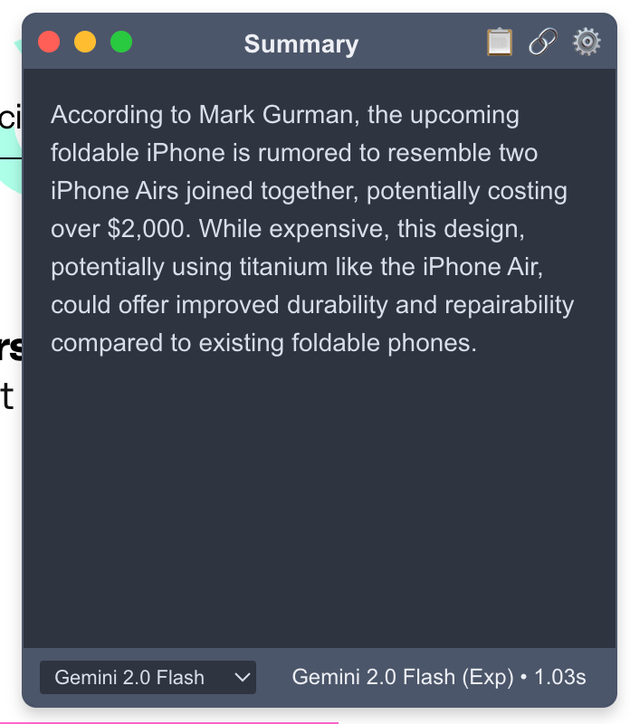
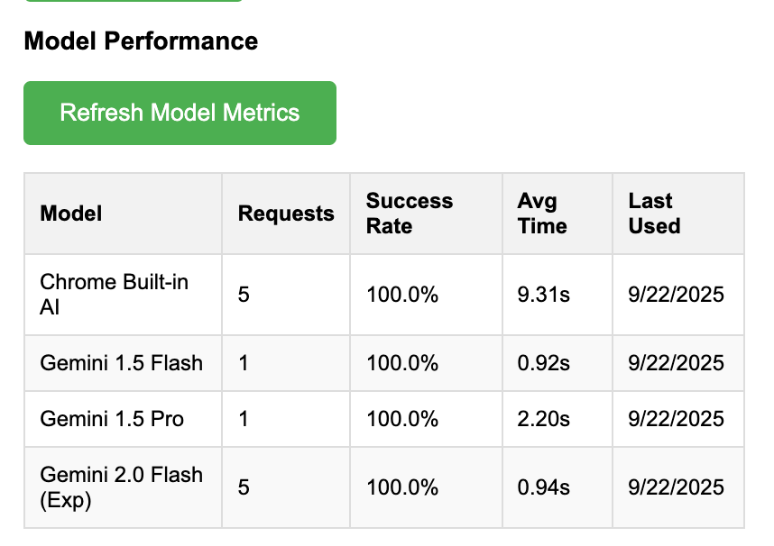

# AI Page Summarizer

[](https://github.com/lassestilvang/ai-summary-extension/actions)
[](https://github.com/your-username/ai-summary-extension)
[](https://opensource.org/licenses/MIT)

## Table of Contents

- [Project Description and Overview](#project-description-and-overview)
- [Key Features and Benefits](#key-features-and-benefits)
- [Prerequisites and System Requirements](#prerequisites-and-system-requirements)
- [Installation Instructions](#installation-instructions)
- [Usage Guide](#usage-guide)
- [API Documentation](#api-documentation)
- [Configuration Options](#configuration-options)
- [Troubleshooting Tips](#troubleshooting-tips)
- [Screenshots](#screenshots)
- [Contribution Guidelines](#contribution-guidelines)
- [License Information](#license-information)
- [Acknowledgments](#acknowledgments)
- [Contact Details](#contact-details)

## Project Description and Overview

AI Page Summarizer is a powerful Chrome extension that leverages artificial intelligence to generate concise summaries of web pages. Built with JavaScript, HTML, and CSS, this extension integrates seamlessly with your browser to provide instant, AI-powered insights from any webpage.

The extension supports multiple AI providers including OpenAI's GPT models, Google's Gemini, Anthropic's Claude, and even Chrome's built-in AI capabilities. It features automatic fallback mechanisms, customizable themes, and performance tracking to ensure reliable and efficient summarization.

## Key Features and Benefits

- **Multi-Provider AI Support**: Choose from a wide range of AI models including GPT-4, Gemini, Claude, and Chrome Built-in AI
- **Automatic Fallback**: If your primary AI provider fails, the extension automatically tries alternative providers
- **Cost-Effective Options**: Includes free models like Chrome Built-in AI and low-cost options
- **Customizable Themes**: Personalize the appearance with various theme options
- **Performance Metrics**: Track model performance, success rates, and response times
- **Secure API Key Storage**: API keys are stored securely using Chrome's storage API
- **Markdown Rendering**: Summaries are rendered using Markdown for better readability
- **Real-time Summarization**: Get instant summaries of the current web page

## Prerequisites and System Requirements

### System Requirements

- **Operating System**: Windows, macOS, or Linux
- **Browser**: Google Chrome or any Chromium-based browser (version 88 or later for Manifest V3 support)
- **RAM**: Minimum 512MB available RAM
- **Storage**: ~5MB free disk space for installation

### Software Dependencies

- **Node.js** (version 18 or later) - Required for development and testing
- **npm** (comes with Node.js) - For managing development dependencies

### API Requirements (Optional)

Depending on your chosen AI model:

- **OpenAI API Key**: For GPT models
- **Google Gemini API Key**: For Gemini models
- **Anthropic API Key**: For Claude models

_Note: Chrome Built-in AI models don't require API keys but may have limited availability._

## Installation Instructions

### For Users

1. **Download the Extension**
   - Visit the [Chrome Web Store](https://chrome.google.com/webstore) (link to be added)
   - Or download the latest release from [GitHub Releases](https://github.com/your-username/ai-summary-extension/releases)

2. **Install in Chrome**
   - Open Google Chrome
   - Navigate to `chrome://extensions`
   - Enable "Developer mode" (toggle in top right corner)
   - Click "Load unpacked"
   - Select the downloaded extension folder

3. **Configure Settings**
   - Click the extension icon in the toolbar
   - Click "Options" or right-click the icon and select "Options"
   - Configure your preferred AI model and API keys (if using paid models)

### For Developers

1. **Clone the Repository**

   ```bash
   git clone https://github.com/your-username/ai-summary-extension.git
   cd ai-summary-extension
   ```

2. **Install Dependencies**

   ```bash
   npm install
   ```

3. **Run Tests**

   ```bash
   npm test
   ```

4. **Load in Chrome**
   - Follow steps 2-4 from the user installation above
   - Select the cloned repository folder

## Usage Guide

### Basic Usage

1. **Navigate to a Web Page**
   - Open any website you want to summarize

2. **Activate the Extension**
   - Click the AI Page Summarizer icon in your browser toolbar
   - The extension will analyze the current page content

3. **View Summary**
   - A popup will appear with the AI-generated summary
   - The summary is displayed in Markdown format for easy reading

### Advanced Usage

#### Customizing AI Models

```javascript
// Example: Programmatically set preferred model
chrome.storage.sync.set({
  selectedModel: 'gpt-4',
  enableFallback: true,
});
```

#### Using Different Themes

- Access extension options
- Select your preferred theme from the dropdown
- Themes affect the appearance of summaries and settings pages

#### Monitoring Performance

- Go to extension options
- Click "Refresh Model Metrics" to view performance statistics
- Track success rates, response times, and usage patterns

### Code Examples

#### Checking Extension Status

```javascript
// Check if extension is active
chrome.runtime.sendMessage({ action: 'get_status' }, (response) => {
  console.log('Extension status:', response);
});
```

#### Custom Summary Requests

```javascript
// Request summary for current tab
chrome.tabs.query({ active: true, currentWindow: true }, (tabs) => {
  chrome.runtime.sendMessage({
    action: 'summarize_page',
    tabId: tabs[0].id,
  });
});
```

## API Documentation

The extension communicates internally using Chrome's messaging API. While there's no public REST API, developers can interact with the extension through Chrome extension APIs.

### Internal Message Types

- `summarize_page`: Triggers page summarization
- `get_model_metrics`: Retrieves performance metrics
- `model_metrics_response`: Response containing metrics data

### Storage Keys

The extension uses `chrome.storage.sync` for persistent settings:

- `selectedModel`: Preferred AI model
- `enableFallback`: Boolean for fallback behavior
- `openaiApiKey`: OpenAI API key
- `geminiApiKey`: Google Gemini API key
- `anthropicApiKey`: Anthropic API key
- `theme`: Selected theme

## Configuration Options

### AI Model Selection

Choose from various AI models with different capabilities and costs:

- **Free Models**:
  - Chrome Built-in AI (Free)
  - Gemini 2.0 Flash Experimental (Free)

- **OpenAI Models**:
  - GPT-3.5 Turbo ($0.002/1K tokens)
  - GPT-4 ($0.03/1K tokens)
  - GPT-4 Turbo ($0.01/1K tokens)
  - GPT-4o ($0.005/1K tokens)

- **Google Gemini Models**:
  - Gemini 1.5 Pro ($0.00125/1K tokens)
  - Gemini 1.5 Flash ($0.000075/1K tokens)

- **Anthropic Claude Models**:
  - Claude 3 Haiku ($0.00025/1K tokens)
  - Claude 3 Sonnet ($0.003/1K tokens)
  - Claude 3 Opus ($0.015/1K tokens)
  - Claude 3.5 Sonnet ($0.003/1K tokens)

### Fallback Settings

- Enable/disable automatic fallback to other models if the primary model fails
- Default: Enabled

### API Keys

- Securely store API keys for paid AI services
- Keys are encrypted and stored locally

### Theme Selection

- Choose from available themes to customize the UI appearance
- Themes are defined in `themes.js`

## Troubleshooting Tips

### Common Issues

**Extension Not Loading**

- Ensure you're using Chrome version 88 or later
- Check that "Developer mode" is enabled in `chrome://extensions`
- Try reloading the extension

**API Key Errors**

- Verify your API keys are correct and have sufficient credits
- Check API key format (OpenAI: sk-..., Gemini: AIza..., Anthropic: sk-ant-...)
- Ensure your API keys have the necessary permissions

**Summarization Fails**

- Try switching to a different AI model
- Check your internet connection
- Ensure the webpage content is accessible (not behind login/paywall)

**Performance Issues**

- Consider using faster models like GPT-3.5 Turbo or Gemini Flash
- Check model metrics in extension options for performance insights

### Debug Mode

Enable debug logging by opening Chrome DevTools (F12) and checking the Console tab for extension-related messages.

### Reset Settings

To reset all settings:

1. Go to `chrome://extensions`
2. Find AI Page Summarizer
3. Click "Details"
4. Scroll to "Site access" and click "Clear storage"

## Screenshots

### Main Interface



_The main extension popup showing a page summary_

### Settings Page


_Configuration options for AI models and API keys_

### Performance Metrics



_Model performance tracking and statistics_

## Contribution Guidelines

We welcome contributions! Please follow these guidelines:

### Development Setup

1. Fork the repository
2. Create a feature branch: `git checkout -b feature/your-feature-name`
3. Install dependencies: `npm install`
4. Run tests: `npm test`

### Code Standards

- Follow ESLint configuration: `npm run lint`
- Use Prettier for code formatting: `npm run format`
- Write tests for new features
- Maintain code coverage above 80%

### Branching Strategy

- `main`: Production-ready code
- `develop`: Integration branch for features
- `feature/*`: New features
- `bugfix/*`: Bug fixes
- `hotfix/*`: Critical fixes for production

### Pull Request Process

1. Ensure all tests pass
2. Update documentation if needed
3. Add screenshots for UI changes
4. Request review from maintainers

### Commit Message Format

```
type(scope): description

[optional body]

[optional footer]
```

Types: feat, fix, docs, style, refactor, test, chore

## License Information

This project is licensed under the MIT License - see the [LICENSE](LICENSE) file for details.

## Acknowledgments

- **AI Providers**: Thanks to OpenAI, Google, and Anthropic for their excellent AI APIs
- **Chrome Extensions**: Built using Manifest V3 for modern Chrome extension development
- **Open Source Libraries**: Utilizes showdown.js for Markdown rendering
- **Contributors**: All contributors who help improve this project

## Contact Details

- **Project Homepage**: [https://github.com/your-username/ai-summary-extension](https://github.com/your-username/ai-summary-extension)
- **Issues**: [GitHub Issues](https://github.com/your-username/ai-summary-extension/issues)
- **Discussions**: [GitHub Discussions](https://github.com/your-username/ai-summary-extension/discussions)
- **Email**: your-email@example.com

---

_Made with ❤️ for efficient web browsing_
